<div align="center">


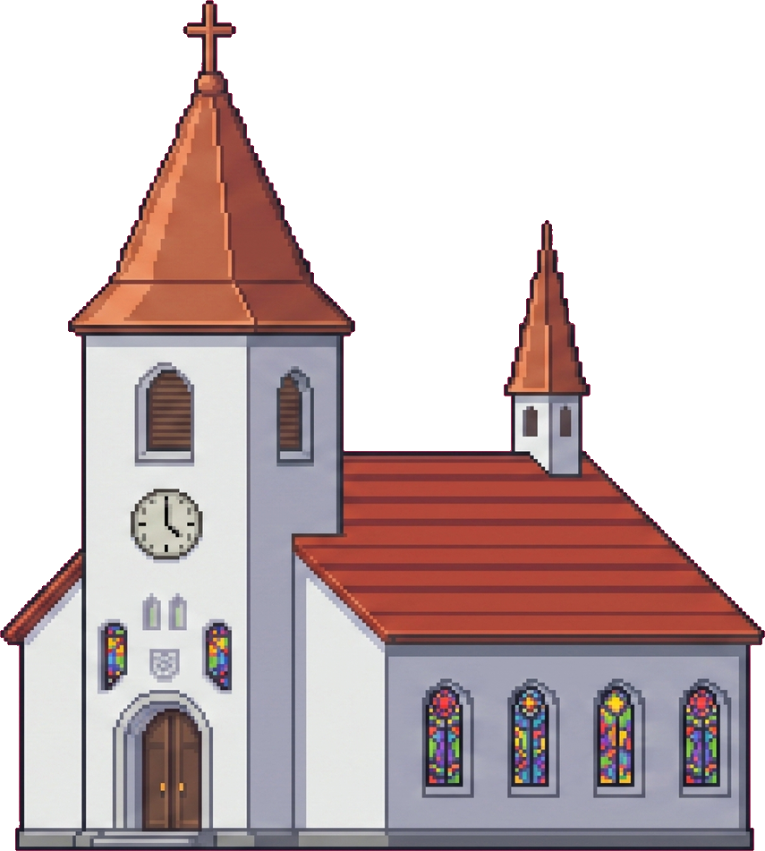

# Bernardo's Christening

**A playable invitation.** Instead of a card, every guest gets a personal link to
a little pixel-art platformer: help **Bernardo the bear** and his dog **Oscar**
collect bones, cross the world, reach the church — and RSVP at the finish line.

Built with Next.js 15 · React 19 · Phaser 3 · Prisma + SQLite · Tailwind

</div>

---

## The event

|                |                                          |
| -------------- | ---------------------------------------- |
| **Child**      | Bernardo Freitas de Souza                |
| **Born**       | 16.06.2026                               |
| **Christening**| 03.10.2026                               |

---

## How it works

```
/?code=MARVIN  →  entrance screen (Dansk / English)
               →  Bernardo greets every person on the invitation by name
               →  platformer: run, hop, collect the day's bones, bounce, kick the ball
               →  reach the church
               →  RSVP + score + bone race submitted
```

- **Personal invite codes.** Each code is a playful portmanteau of the invitees'
  own names — `BIBEDRO` (Bibi + Pedro), `MARVIN` (Marie + Kevin), `THADRA`
  (Thales + Sandra). Solo guests get Bernardo's own `-ARDO` ending.
- **Bernardo says hello.** The invitation line is one household — "Marie and
  Kevin", "Carlos, Dinha, Sonia & Morges" — so it is taken apart again and
  Bernardo welcomes each person by name, in the language the link was opened in.
  Then Oscar takes over and explains the bones.
- **Leaderboard.** 10 points per bone, 100 per blessing, 250 for reaching the
  church. Best run per guest wins.
- **A new set of bones every day.** See [Daily bones](#daily-bones) below.
- **Oscar grows.** The more bones you collect, the bigger Oscar gets — from
  scale 1.2 up to 2.1 at 40 bones.
- **Two languages.** Danish by default, English opt-in, stored in localStorage.
- **Original chiptune soundtrack**, synthesised in the browser with Web Audio.


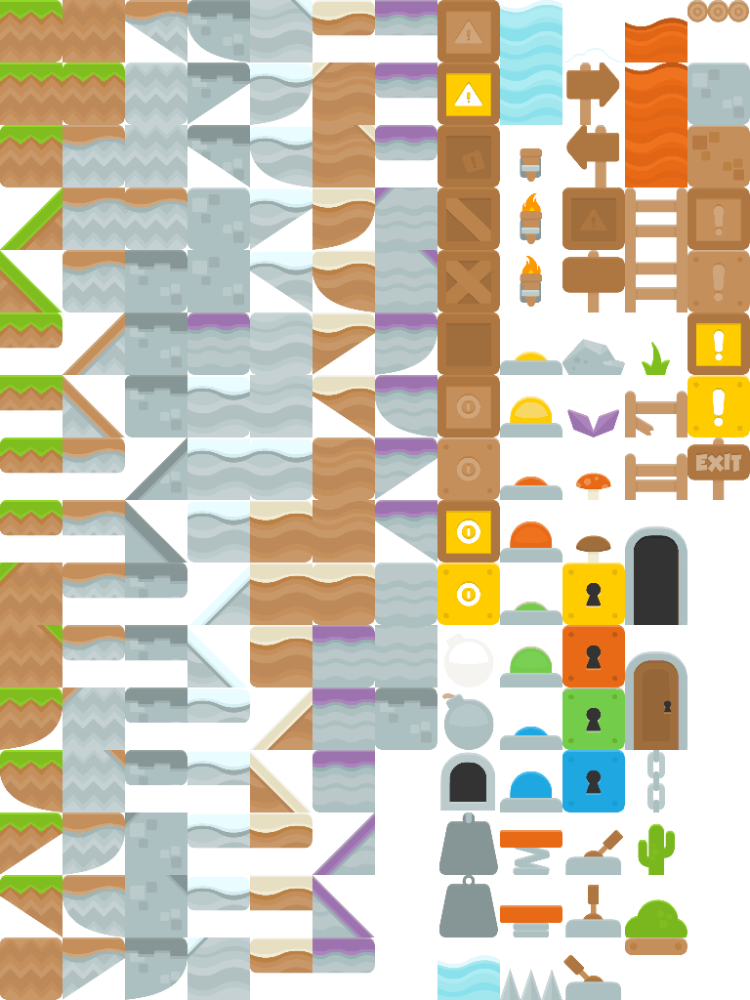

---

## Screenshots

Every guest opens their own link and is greeted by name — then the level starts.

<table>
  <tr>
    <td width="50%">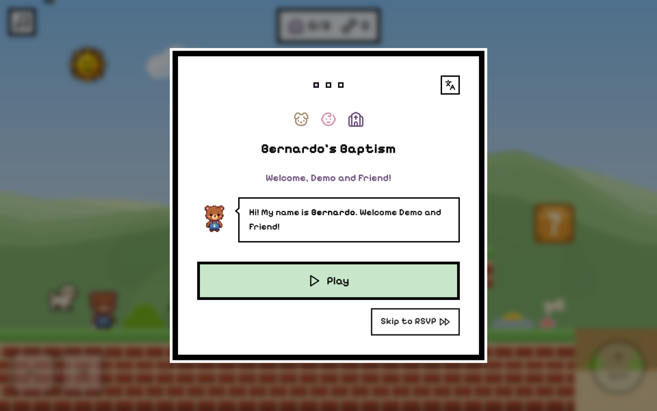</td>
    <td width="50%">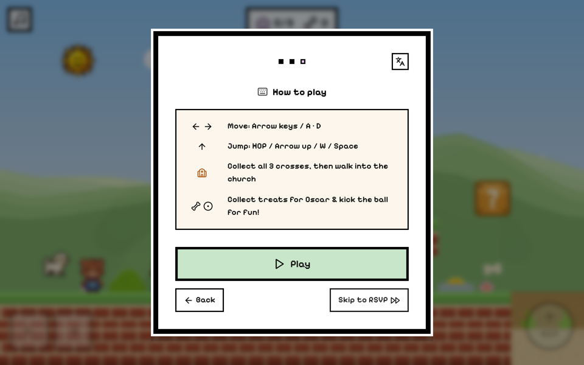</td>
  </tr>
  <tr>
    <td align="center"><em>Bernardo greets every person on the invitation, by name</em></td>
    <td align="center"><em>Four lines of instructions, and you are off</em></td>
  </tr>
</table>

A single 132-tile level runs from Hvidovre Hospital, where Bernardo was born, all
the way to Filips Kirke — past windmills, half-timbered houses, a lighthouse, and
flagpoles cycling Denmark → Brazil → Pernambuco → Straw Hat.

<table>
  <tr>
    <td width="50%">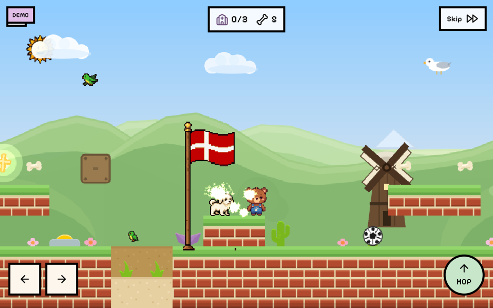</td>
    <td width="50%">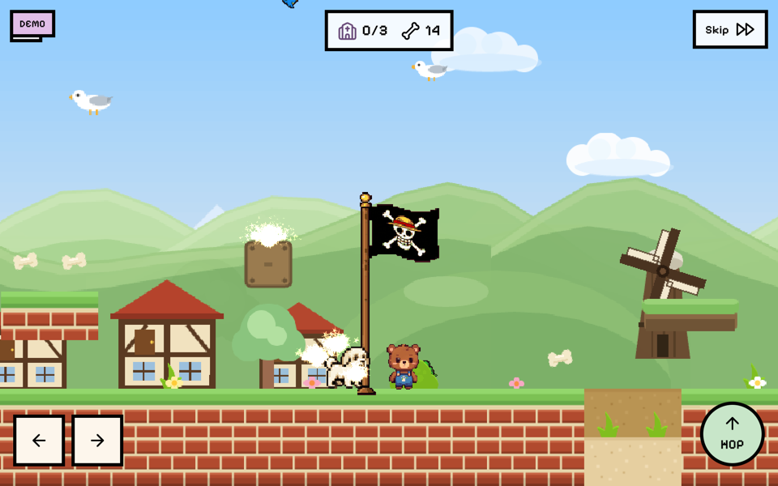</td>
  </tr>
  <tr>
    <td align="center"><em>The run starts where Bernardo did</em></td>
    <td align="center"><em>Oscar grows with every bone he is fed</em></td>
  </tr>
</table>

<div align="center">
  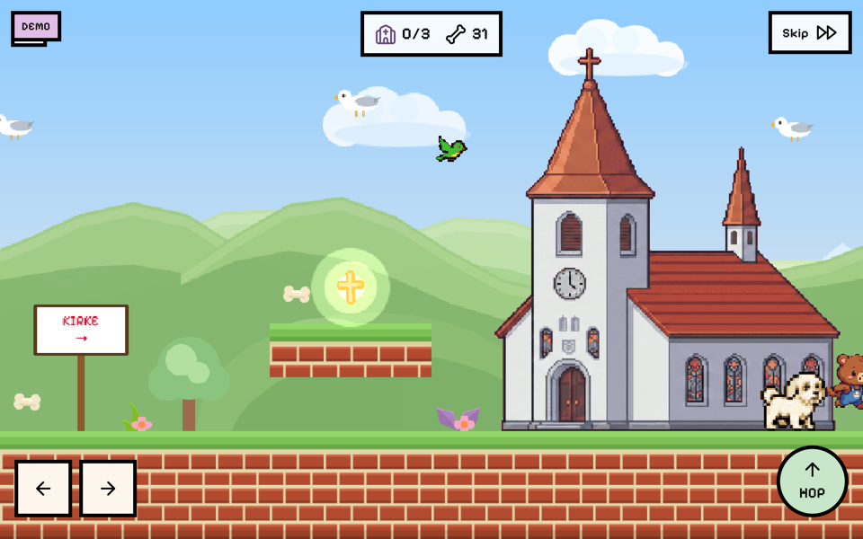
  <br />
  <em>The finish line: 250 points, and the RSVP opens</em>
</div>

The reply is per person, not per invitation — "Marie and Kevin" answer
separately, for the church and for the party.

<table>
  <tr>
    <td width="50%">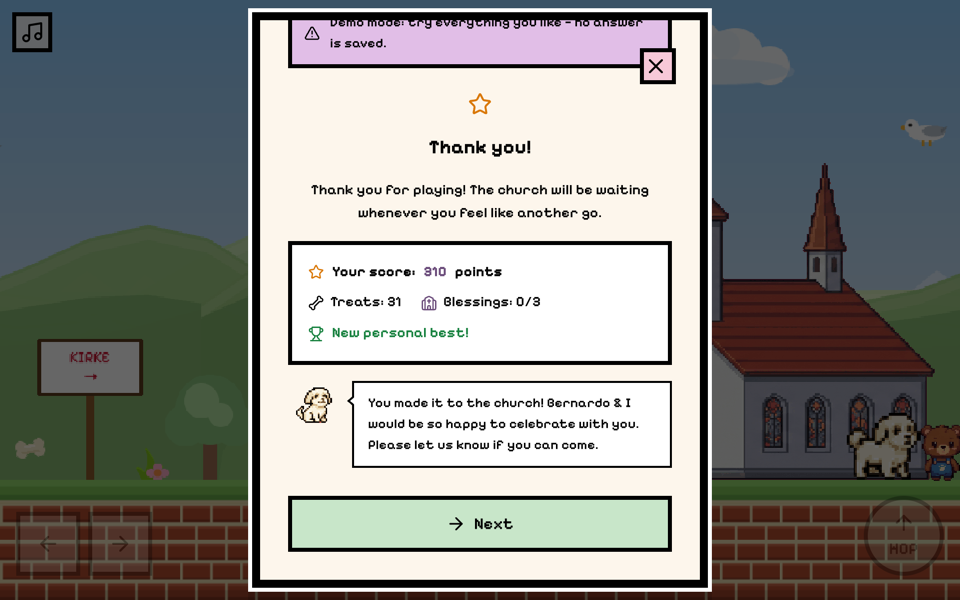</td>
    <td width="50%">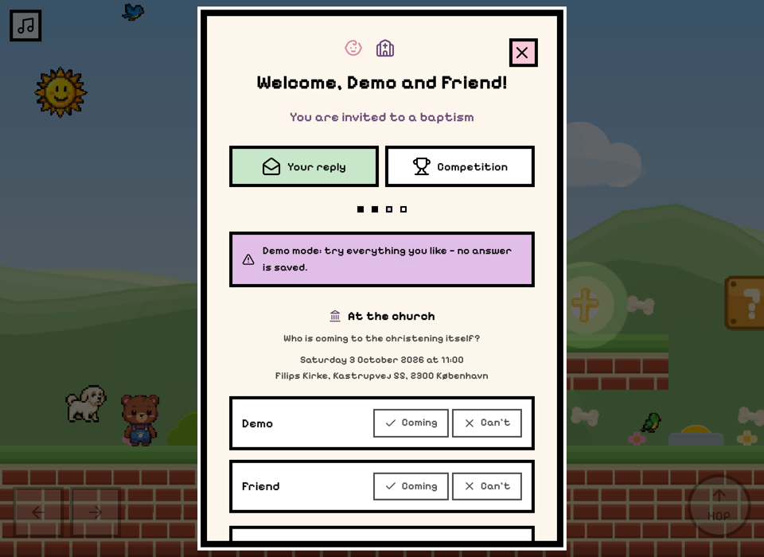</td>
  </tr>
  <tr>
    <td align="center"><em>10 per bone, 100 per blessing, 250 for the church</em></td>
    <td align="center"><em>One invitation, answered person by person</em></td>
  </tr>
  <tr>
    <td width="50%">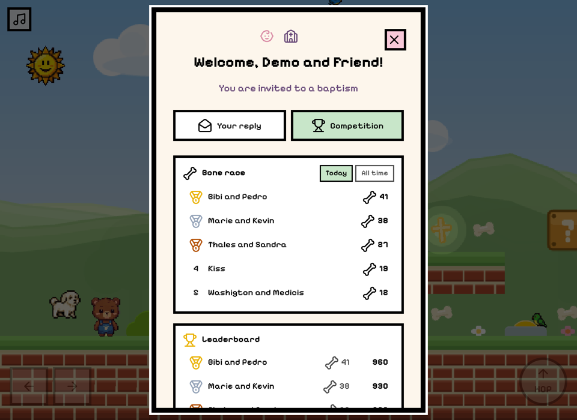</td>
    <td width="50%">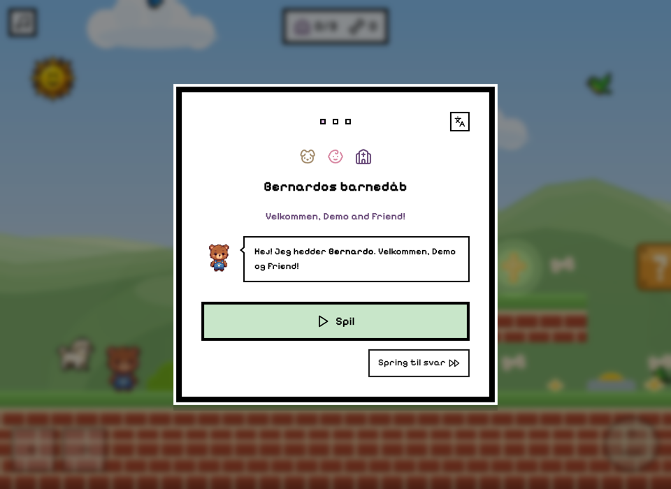</td>
  </tr>
  <tr>
    <td align="center"><em>A fresh bone race every day, plus the all-time board</em></td>
    <td align="center"><em>Dansk by default — <code>?lang=</code> switches it</em></td>
  </tr>
</table>

Behind the invitation there is a small admin panel: who has replied, who is
coming to the church, who is staying for the party, and a copyable personal link
per household. *(Guest names below are stand-ins.)*

<div align="center">
  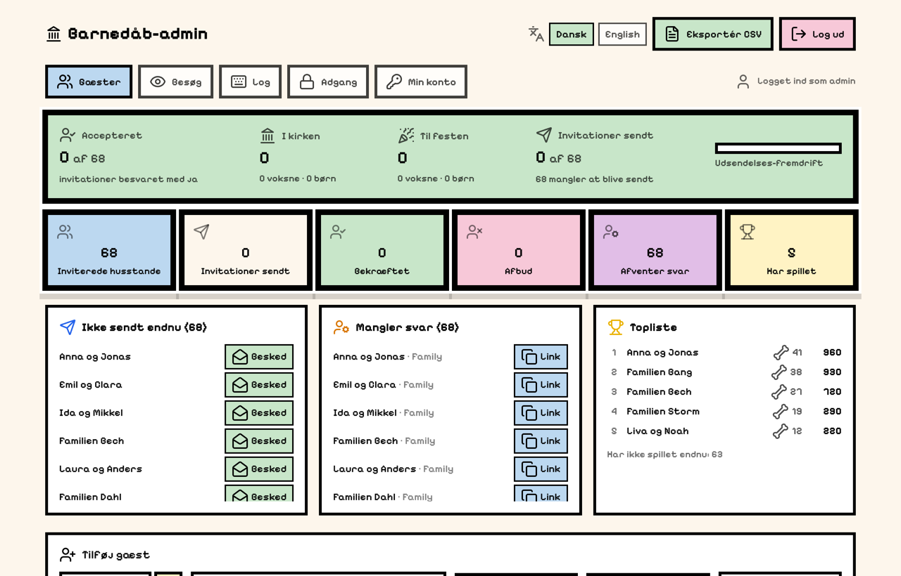
</div>

---

## Daily bones

Oscar has to be fed *every day*, so the treats are no longer part of the level:
a fresh set of 42 is laid out each morning, somewhere else every time.

**How the layout is decided.** `lib/dailyBones.ts` derives the positions from the
date alone — a seeded shuffle over the tiles the generator has proved are free
(open ground and the tops of static platforms; never a moving raft, a "?" block,
a blessing, a pit, a tree, a flag, a springboard, a football or a building). The
day rolls over at midnight in `Europe/Copenhagen`.

Because it is derived and not stored:

- every guest playing on the same day sees exactly the same bones in the same
  order, so the competition is fair;
- the **server regenerates the same layout** and checks every reported bone
  against it, so a pickup is verified rather than trusted.

**How they are handed in.** The game reports *which* bone was picked up, not how
many. Pickups are queued and flushed on a **500 ms tick, and only when there is
something to send** — a good run is a handful of requests, an idle game makes
none at all. A failed flush puts its bones back in the queue, and the tab going
away flushes what is left.

Handing the same bone in twice changes nothing: `BoneCollection` is unique on
(guest, day, bone), so a retry, a reload or two overlapping flushes are all
absorbed silently. That is what makes a best-effort client safe.

**A fetched bone stays fetched.** Before the level is built the game asks which
of today's bones this guest has already handed in, and simply leaves those out —
so reloading is not a way to walk the same route again, and a guest coming back
mid-morning sees only what is left for them. The duplicates would have been
dropped by the unique key anyway; this is about the ground matching the
standings.

**The competition.** `/api/bones/leaderboard` returns two standings from the same
rows — today's race and the running total. Bones popped out of a "?" block are
bonus treats that belong to no day: they count towards the score and towards
feeding Oscar, but not towards the race.

The closing screen has two tabs. It opens on **the reply**, because that is what
the invitation is actually asking for and nothing should sit between the guest
and the yes/no buttons. **The competition** — the bone race and the score
leaderboard — is one tap away, and stays reachable after the reply is sent.

| Endpoint                  |                                                          |
| ------------------------- | -------------------------------------------------------- |
| `GET /api/bones`          | The day currently open, how many bones it holds, and (with `?code=`) which of them a guest already has |
| `POST /api/bones`         | Hand in a batch: `{ guestCode, day, bones: number[] }`    |
| `GET /api/bones/leaderboard` | Today's race and the all-time race                    |
| `POST /api/visit`         | Counts an opened invitation, once per browser session    |

---

## Admin panel

`/admin` — real accounts, stored in the database.

- **Guests** — guest list with group, status, invited capacity (max adults and
  max kids), the numbers each household actually confirmed, and their score
- **Invitation generator**: per guest, in **Danish, English and Portuguese**,
  in a short WhatsApp form and a long e-mail form, with copy-to-clipboard plus
  direct "open WhatsApp" / "open e-mail" links
- **Adding and editing households** — invitation codes are proposed from the
  names as you type (and can always be overruled), and a household's answer can
  be given person by person straight from the list, for the replies that arrive
  by phone or at the door. "No answer yet" is a real state: answering for one
  person never decides for anybody else, and pressing an answer again takes it
  back
- **Invitation-sent tracking** with a timestamp, a filter and a progress bar
- Headline counters: how many have accepted, and how many people that is
  (adults + kids) — always counted within each invitation's capacity, so a
  household invited without children never appears with any
- CSV export
- **Visits** — who has actually opened their invitation, by country, browser,
  system, device, language and where the link was followed from, with the public
  demo counted separately and a per-household list showing who has never looked.
  No addresses are stored: a visitor is a hash of address, browser and *day*,
  so the count is honest for a day and anonymous forever
- **Activity log** — every login (successful, failed or locked out), every
  invitation sent or opened, every guest and administrator change, every
  database reset and every blocked or throttled request, filterable by action
  and by user
- **Access** — add administrators, remove them, remove yourself. The one rule
  the server enforces is that the last administrator always stays, so the panel
  can never be locked away from everybody
- **My account** — change your own password

### Authentication

There are no credentials in the environment or in this repository.

- Passwords are salted **scrypt** hashes in the database.
- The session cookie is an opaque random token; only its SHA-256 digest is
  stored, it is `httpOnly` + `SameSite=strict`, it expires after 12 hours and it
  can be revoked. Changing a password signs every other browser out.
- Five wrong passwords lock the account for 15 minutes, and the login endpoint
  is throttled per IP *and* per account.
- A fresh database bootstraps a single administrator — **`admin` / `admin`** —
  which can do nothing at all except set a strong password. The panel and the
  API both refuse every other action until it has.

Password policy: at least 12 characters, upper and lower case, a digit, a
symbol, not a common password and not the username.

### Request protection

`middleware.ts` sits in front of every request and applies rate limits (a global
budget per address plus a tighter one for `/api`), screens the path and query
string for SQL-injection, script and traversal markers, blocks the usual scanner
paths, and sets CSP, `X-Frame-Options`, `nosniff`, referrer and permissions
headers. Each route additionally caps its request body (16 KB), rejects payloads
carrying injection markers or prototype-pollution keys, and validates every
field before it reaches Prisma — which parameterises the queries themselves.
Guest-facing writes (RSVP, score) are throttled per address as well.

---

## Getting started

```bash
npm install
cp .env.example .env      # DATABASE_URL only
npm run db:push           # create the SQLite schema
npm run seed              # load the guest list and the first admin
npm run dev
```

Open <http://localhost:3000> for the invitation and
<http://localhost:3000/admin> for the panel. Log in with `admin` / `admin` and
set a strong password when prompted.

### Environment variables

`.env` is gitignored, and there is only one variable left — the admin
credentials moved into the database where they can be rotated and revoked.

| Variable       | Purpose                                       |
| -------------- | --------------------------------------------- |
| `DATABASE_URL` | Prisma connection string, e.g. `file:./dev.db` |

---

## Deployment

Pushing to `main` runs `.github/workflows/release.yml`: it typechecks and builds
first, and only deploys if that passes. You can also trigger it manually
("Run workflow") or by publishing a GitHub Release.

The server is a Hetzner CAX11 running the app under systemd behind Caddy, which
terminates TLS with automatic Let's Encrypt certificates.

### The production database is never overwritten

`scripts/deploy.sh` is built so a deploy cannot destroy real RSVPs:

1. The live database is **backed up first** (`sqlite3 .backup`, WAL-safe) into
   `backups/`, keeping the last 20.
2. `prisma db push` runs **without `--accept-data-loss`** — a schema change that
   would drop a column **fails the deploy** instead of silently deleting answers.
3. Seeding is opt-in via `SEED_MODE`:

| `SEED_MODE`  | Behaviour                                                                 |
| ------------ | ------------------------------------------------------------------------- |
| `if-missing` | **Default.** Seeds only when there is no production database yet. An existing database is left completely untouched. |
| `never`      | Never seeds, even on a fresh database.                                     |
| `force`      | Re-runs the seed. It **upserts**, so names and new guests are refreshed while every RSVP, score and sent-flag survives. |

On a first deploy the database is created and planted with the guest list in a
clean state: everyone `PENDING`, no scores, nothing marked as sent.

Finally the service restarts and the deploy only succeeds if the app answers
`200`.

### Required repository secrets

| Secret               | Purpose                                    |
| -------------------- | ------------------------------------------ |
| `DEPLOY_HOST`        | Server IP                                  |
| `DEPLOY_USER`        | Deploy user (`deploy`)                     |
| `DEPLOY_SSH_KEY`     | Private key of a dedicated CI-only keypair |
| `DEPLOY_KNOWN_HOSTS` | Pinned host key, so a deploy cannot be redirected elsewhere |

## Resetting the database

The admin panel has a **Farezone** (danger zone) at the bottom with three
separate blast radii. Each one requires typing `RESET` to confirm.

| Action                   | Clears                              | Keeps                                     |
| ------------------------ | ----------------------------------- | ----------------------------------------- |
| **Nulstil topliste**     | bones, blessings, scores, play time | RSVPs, guest list, sent flags             |
| **Nulstil svar**         | RSVPs + all game progress           | guest list, invitation-sent flags         |
| **Nulstil hele databasen** | everything                        | nothing — rebuilds the list from `prisma/guests.ts` |

The first two also clear the bone race, because a standing with no rows behind
it is a lie. None of them touch the administrator accounts or the activity log,
and every reset is recorded in the log with the name of whoever ran it.

### Resetting production, including the admin password

The panel cannot reset itself: it can clear answers, but not the password of the
administrator who is logged in to clear them. That is what the **"Reset
production database"** workflow is for
(`.github/workflows/reset.yml` → `scripts/reset-prod.sh`).

Run it from the Actions tab and type `RESET` into the confirmation box. It:

1. **Rehearses first** on a throwaway database in CI — schema, guest list,
   verification. A broken guest list fails there, not halfway through replacing
   the real one.
2. **Backs the live database up** on the server (WAL-safe) into
   `backups/pre-reset-*.db`, so the old data stays recoverable.
3. **Builds a clean snapshot** in a temporary file: schema, the full guest list
   from `prisma/guests.ts`, and the documented first-run administrator —
   `RESET_ADMIN=1` removes every existing admin and every live session and
   plants `admin` / `admin`, which the panel forces to be changed at login.
4. **Verifies the snapshot** with `npm run db:verify` *before* it goes anywhere
   near production: every guest on the list registered, every invitation with
   the right capacity, an administrator present.
5. Only then stops the service, **swaps the snapshot in**, restarts and
   health-checks the site.

The swap is the last destructive step, so a failure at any earlier point leaves
production exactly as it was. It shares the `release-production` concurrency
group, so a reset can never race a deploy.

## Scripts

| Command          | What it does                              |
| ---------------- | ----------------------------------------- |
| `npm run dev`    | Development server                        |
| `npm run build`  | `prisma generate` + production build      |
| `npm run start`  | Serve the production build                |
| `npm run db:push`| Sync the Prisma schema to SQLite          |
| `npm run seed`   | Upsert the guest list (never overwrites answers) and create the first admin |
| `npm run db:backfill` | Fill in invitation capacity for rows that predate it (idempotent) |
| `npm run db:verify` | Check a database is fit to be production: every guest registered with the right capacity, and an administrator present |
| `npm test`       | Unit tests for the password policy, the invitation capacity rules, the daily bone layout, the throttled hand-in and the name splitting |

---

## Invitation capacity

Every household is invited for a fixed number of people: `maxGuests` adults and
`maxKids` children. `maxKids = 0` means the invitation has no room for children,
and the RSVP form does not even offer the choice.

`guestCount` and `kids` are what the household confirmed. They are clamped to
the capacity in the RSVP API, in the admin API and again when the head count is
totalled (`lib/capacity.ts`), so an answer given before a capacity was tightened
can never inflate the final numbers.

---

## Continuous integration

`.github/workflows/ci.yml` runs on every branch and pull request: typecheck,
unit tests, production build, and a schema-plus-seed-plus-verify dry run against
an empty database. The release workflow runs the same gates before it is allowed
to deploy, and the reset workflow rehearses the whole reset before touching the
server.

---

## Project layout

```
app/                 Next.js routes — invitation, /admin, /api/*
components/          React UI (intro, RSVP, leaderboard, bone race, icons)
components/game/     Phaser scene factory and procedural textures
components/admin/    Admin-only UI (invitations, danger zone, access, activity log)
lib/                 config, i18n, invite templates, auth, audit, rate limiting
lib/dailyBones.ts    the day's bone layout, derived from the date
lib/boneReporter.ts  the 500 ms throttled queue that hands bones in
lib/names.ts         splitting a household line into the people in it
lib/inviteCode.ts    proposing an invitation code from the names on it
lib/rsvpAnswers.ts   applying an answer, whoever gave it, to the right people
lib/visitInfo.ts     what a visit says about itself — country, browser, device
middleware.ts        Rate limiting, injection screening and security headers
lib/levels/          level data
prisma/              schema, seed, verification and the real guest list
public/assets/game/  pixel art (CC0 — see CREDITS.md)
```

## Credits

Pixel art from [Kenney](https://kenney.nl) under CC0 — see
[`public/assets/game/CREDITS.md`](public/assets/game/CREDITS.md). Characters,
props and music are generated procedurally in code.
